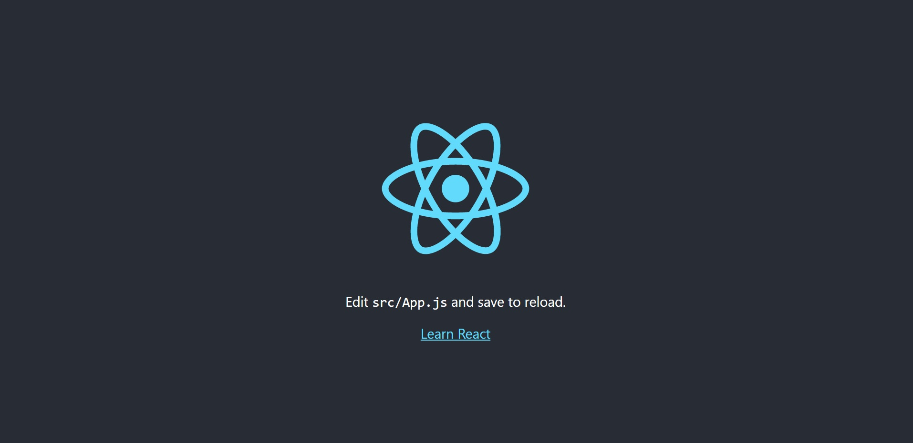

# 🎯 01-02. 리액트 개발 환경 설치

## 🌏 yarn과 create-react-app 설치

### 👉 yarn 설치

```shell
npm install -g yarn
```

### 👉 create-react-app 설치

```shell
yarn global add create-react-app
```

### 👉 리액트 앱 생성

```shell
create-react-app do-it-example
```

create-react-app이 안되면 아래 명령어를 사용하여 설치후 프로젝트 생성.

```shell
npm install -g create-react-app
create-react-app do-it-example
```

### 👉 리액트 앱 구동하기

```shell
cd do-it-example
yarn start
```




## 🌏 예제에 필요한 라이브러리 미리 설치하기

계속 에러가나서 일단 변경하지않고 진행.<br/>(추가로 설치할 일이 생기면 그때그때 설치해서 진행할 예정)

### 👉 1. package.json 수정

http://www.easyspub.co.kr/30_Menu/DataList/PUB

위의 사이트- 자료실에서 해당 책의 github 다운로드 링크를 통해 다운받고, package.json을 수정.


### 👉 2. package.json에 적힌 라이브러리 모두 설치

```shell
yarn
```

경고 뜨는부분은 호환성관련 메세지로 제작당시 명시된 버전과 다르다는 것을 알려주는 내용.


### 👉 3. babel-loader 호환성 오류 해결

현재 package.json에 적어둔 babel-loader버전은 최신 버전인 create-react-app의 babel-loader와 충돌 발생함.

루트폴더에 npm 환경 변수 파일을 만들어 저장.

```env
// ./.env
SKIP_PREFLIGHT_CHECK = true
```

! 오류발생

Cannot find module오류가 계속 발생할 때, yarn으로 패키지가 제대로 설치되지 않는다면 node_module폴더를 삭제하고 다시 yarn을 실행하여 패키지를 설치 해보세요.


## 🌏 비주얼 스튜디오 코드와 플러그인 설치

### 👉 1. Reactjs code snippets 플러그인

코드 뭉치를 자동으로 완성해주는 플러그인.

src - 01폴더에 RCC.jsx를 생성하고, 편집화면에 rcc라고 입력하면 목록이 나타남.<br/>rcc선택하면 코드가 자동으로 생성됨.

class이름을 파일명(RCC)로 변경.

### 👉 2. Prettier-Code Formatter

코드의 줄바꿈등의 스타일을 자동으로 변환해주는 플러그인

설정

```text
"useTabs" : false, //tab사용시 빈칸으로 채움
"printWiddth" : 100, // 파일 최대 길이를 100칸
"tabWidth": 2, // 탭의 빈칸을 두칸으로
"trailingComma" : "all", // 나열 항목의 마지막에 항상 쉼표붙임
"semi": true, // 실행 줄 마지막에 항상 세미콜론붙임
"singleQuote": true // 문자따옴푠느 ''로 통일
```

RCC.jsx를 열고 Ctrl+Shift+P하면 명령어 팔레트가 나옴.<br/>Format을 검색하면 Format Document라는 명령어 찾을 수 있음.<br/>Enter눌러 실행하면 정리되는걸 볼 수 있다.

Settings에서 formatOnSave를 입력하고, 체크를 하면 저장 할 때 마다 정리됨.

