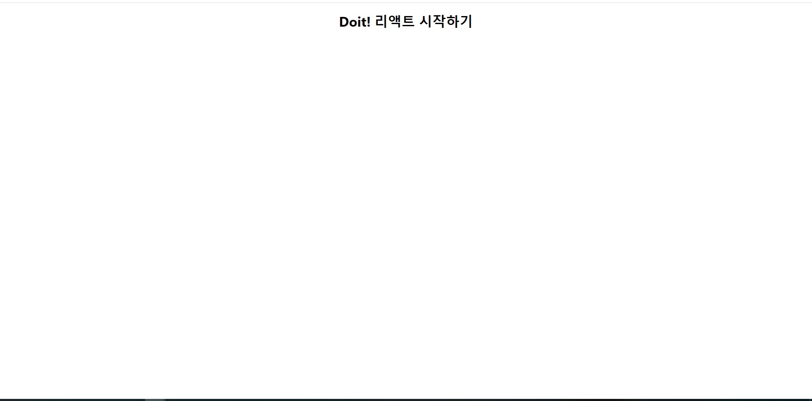

# 🎯 01-03. 리액트 앱 수정하기

src폴더의 App.css를 수정하여 화면 스타일을 바꿔 보자.

## 🌏 1. App.css수정하기

```css
...
.title{
    font-style:italic;
}
```


## 🌏 2. 스타일 반영하기

App.js를 수정하기

```javascript
import React, {Component} from 'react';
import './App.css';
class App extends Component{
    render(){
        return(
        	<div className="App">
            	<h1 className="title">Doit! 리액트 시작하기 </h1>
            </div>
        )
    }
}
export default App;
```


render()함수는 HTML을 반환함. 이것이 웹 브라우저에 출력이 된다.

HTML 스타일 클래스 이름은 JS 클래스(class)키워드와 같으므로 **리액트에서는 class가 아니라 className**으로 정의해야함.


## 🌏 3. 리액트 핫 리로딩으로 변경된 화면 확인하기

저장하면 바로 바뀌는걸 볼 수 있는데 그 이유는 create-react-app의 핫 리로딩 이라는 모듈 덕분.

