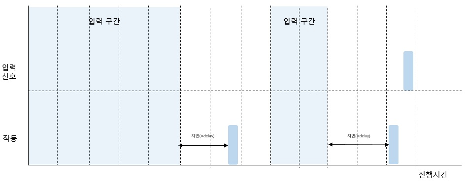
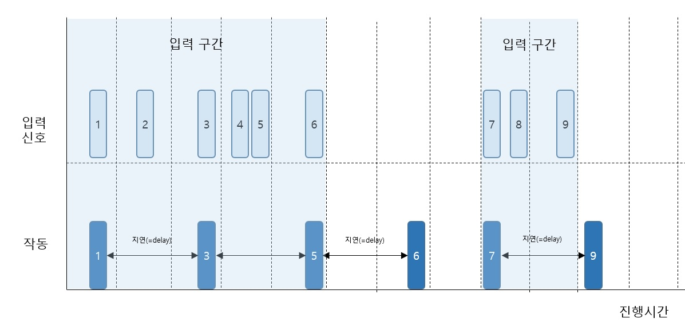

# 🎯 02-10. 디바운스와 스로틀

es6의 문법은 아니지만 앞에서의 <strong>'지연처리'</strong>를 효율적으로 다룰 수 있다.

서버의 데이터를 요청하는 등의 작업에서 생기는 부하를 크게 줄여줌.


## 🌏 디바운스

디바운스(debounce)는 어떤 내용을 입력하다가 특정 시간 동안 대기하고 있으면 마지막에 입력된 내용을 바탕으로 서버 요청을 하는 방법입니다.

(<strong>연관 검색어</strong>)



func인자가 '서버요청', delay인자를 '지연 시간'으로 생각

```javascript
// ./src/02/debounce.js
// debounce.js를 실행하려면 export를 삭제해야 합니다.
// 실행 후 다시 export를 넣어주세요. (이후 실습 진행 시 참조합니다.)
export function debounce(func, delay){
    let isDebounce;
    return function(...args){
        if(inDebounce){
            clearTimeout(inDebounce);
        }
        inDebounce = setTimeout(
            () => func(...args),
            delay);
    }
}

const run = debounce(val => console.log(val), 100);
run('a');
run('b');
run(2);
```

<strong>debounce가 반환하는 익명 함수를 주목!</strong>

* ...args는 run()함수의 인자를 담고있는 배열을 얻기 위해 사용했고, inDebounce 변수는 지연 대기 시간 내에 입력 신호가 호출 될 떄 실행 대기 함수를 취소하기 위해 사용했습니다.

* inDebounce변수에는 매 debounce()함수 실행 시 setTimeout()함수의 반환값이 저장됨.

* 이 때 inDebounce에 값이 있으면, clearTimeout()함수로 지연 실행 대기중인 setTimeout()함수의 작업을 취소함.
* 즉, 100ms안에 run()함수를 호출하지 않으면 최종으로 호출된 run()함수에 대한 결과만 볼 수 있다.
* 코드 실행 시 run(2)에 대한 결과만 확인할 수 있다.


## 🌏 스로틀

디바운스와 비슷하지만, <strong>'입력되는 동안에도 바로 이전에 요청한 작업을 주기적으로 실행한다'</strong> 

(<strong>무한 스크롤</strong>)


입력신호에 해당하는 것을 '스크롤'로, 작동에 해당하는 것을 '타임라인 로딩'으로 생각



지연시간동안 스크롤 움직이면 여러 번의 서버요청이 발생하는데, <br/>
디바운스와 다르게 스로틀은 첫 번쨰 요청이 지연 실행되는 동안에는 중복된 요청을 무시하고 <br/>
실행 이후에 첫 번째로 호출되는 요청을 동일하게 지연 실행하여 구간 내에서는 중복 요청 과정을 생략 함.

```javascript
// ./src/02/throttle.js
function throttle(func, delay){
	let lastFunc;
	let lastRan;
	return function(...args){
		const context = this;
		if(!lastRan){
			func.call(context, ...args);
			lastRan = Date.now();
		}else{
			if(lastFunc) clearTimeout(lastFunc);
			lastFunc = setTimeout(function(){
				if((Date.now() - lastRan) >= delay){
					func.call(context, ...args);
					lastRan = Date.now();
				}
			}, delay - (Date.now() - lastRan));
		}
	}
}

var checkPosition = () =>{
	const offset = 500;
	const currentScrollPosition = window.pageYOffset;
	const pageBottomPosition = document.body.offsetHeight - window.innerHeight - offset;
	if(currentScrollPosition >= pageBottomPosition){
		// fetch('/page/next')
		console.log('다음 페이지 로딩');
	}
};
var infiniteScroll = throttle(checkPosition, 300);
window.addEventListener('scroll', infiniteScroll);
```

func는 스크롤이 이동할 때 호출되는 '서버 요청', delay는 '호출 생략 시간'

* func()함수가 처음실행(!lastRan)될 때 <strong>'함수를 즉시 실행하고, 실행 시간(lastRan)을 저장한다'</strong>는 점이 다르다
* 이후(lastRan)함수를 실행하는 요청이 오면 setTimeout()함수를 실행하지만, 지연시간을 계산(Date.now() - lastRan)하고, 이 값이 delay보다 커야만 func()함수를 실행시킵니다.
* 스크롤을 움직이는 동안 주기적으로 '다음페이지 로딩'이 console에 출력됨.

