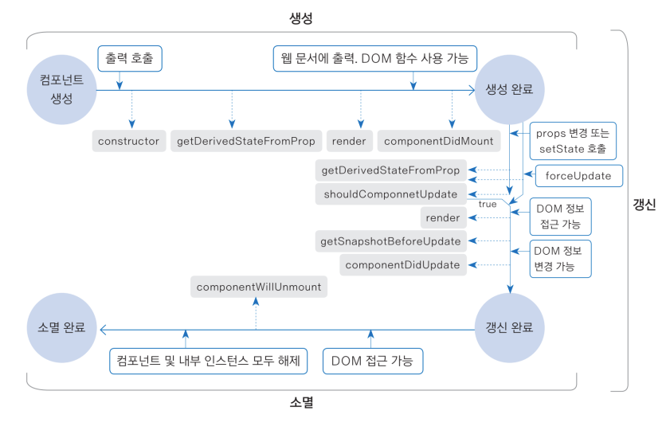

# 🎯 03-05. 컴포넌트의 생명주기

생명주기란?<br/>컴포넌트의 생성부터 소멸까지의 과정.<br/>컴포넌트는 생명주기마다 함수를 가지고 있다.

## 🌏 생명주기 함수 살펴보기

총 8종의 함수가 있다.<br/>리액트엔진에서 자동으로 호출된다. => 개발자가 마음대로 호출 불가.



* **생성 과정 :** 생성부터 생성완료까지 4개의 생명주기 함수가 호출된다.  이 과정을 생성 과정이라고한다.

  * constructor
  * getDerivedStateFormProp
  * render
  * componentDidMount

* **갱신 과정 :** 생성완료 부터 갱신완료까지 5개의 생명주기 함수가 호출됨. 이 과정을 갱신 과정이라고 한다.

  * getDerivedStateFromProp
  * shouldComponentUpdate
  * render
  * getSnapshotBeforeUpdate
  * componentDidUpdate

  이때 갱신 과정은 shouldComponentUpdate()함수의 반환값에 따라 true인 경우 이후 과정이 진행되고,false인 경우 이후 과정이 모두 생략됨.(갱신 과정 생략)

* **소멸 과정 :** 갱신완료부터 소멸 완료까지 1개의 생명주기 함수가 호출된다. 이 과정을 소멸 과정이라고한다.

  * componentWillUnmount

### 👉 constructor(props)함수

**'맨 처음에 생성될 때 한 번만 호출'**

상태(state)를 선언 할 때 사용됨.

**항상super()함수를 가장 위에 호출**해야 합니다.<br/>프로퍼티와 생명 주기 상태 등을 초기화하는 중요한 과정을 포함하고 있기 때문입니다.

```jsx
...
consturctor(props){
    super(props);
}
```


### 👉 render()함수

데이터가 변경되어 새 화면을 그려야 할 때 자동으로 호출되는 함수.

반환하는 JSX를 화면에 그려줌.


### 👉 static getDerivedStateFromProps(props, state) 함수

정적함수 이다.

함수안에 this.props나 this.state와 같은 방법으로 프로퍼티나 state에 접근이 불가함.

접근해야한다면 반드시 인자로 전달된 props, state를 이용해야 합니다.<br/>이때 props는 사우이 컴포넌트에서 전달된 값이며, state는 현재 컴포넌트의 state값.

상위 컴포넌트에서 전달받은 프로퍼티로 state값을 연동할 때 주로 사용됨.

반환값으로 state를 변경함.


### 👉 componentDidMount()함수

render()함수가 JSX를 화면에 그린 이후에 호출되는 함수.

컴포넌트가 **화면에 모두 표현된 이후 해야하는 작업들**은 여기에서 하면됨.


### 👉 shouldComponentUpdate(nextProps, nextState) 함수

프로퍼티를 변경하거나 setState()함수를 호출하여 s**tate값을 변경하면 '화면을 새로 출력해야 하는지'판단**하는 함수.

화면을 **새로 출력할지 말지 판단**하며, **데이터 변화를 비교하는 작업을 포함**하므로 **리액트 성능에 영향**을 많이 줍니다.

**화면 변경을 위해 검증 작업을 해야 하는 경우 이 함수를 사용**하면 됨.

forceUpdate()함수를 호출하여 화면을 출력하면 이 함수는 호출되지 않음.


### 👉 getSnapshotBeforeUpdate(prevProps, prevState) 함수

컴포넌트의 변경된 내용이 가상 화면에 완성된 이후 호출되는 함수.

컴포넌트가 화면에 **실제로 출력되기 전에 호출**되므로 화면에 출력될 엘리먼트의 크기 또는 스크롤 위치등의 **DOM정보에 접근할 때 사용**.


### 👉 componentDidUpdate(prevProps, prevState, snapshot) 함수

컴포넌트가 실제로 출력된 이후 호출되는 함수.

부모 컴포넌트로부터 전달된 **이전 프로퍼티와 이전 state값**과 함께 **getSnapshotBeforeupdate()함수에서 반환된 값**을 인자로 전달받음.

스크롤 위치를 옮기거나 커서를 이동시키는 등의 **DOM정보를 변경할 때 사용됨.**


### 👉 componentWillUnmount() 함수

컴포넌트가 소멸되기 직전에 호출되는 함수.

컴포넌트에서 감시하고 인쓴 작업들을 해제할 때 필요한 함수.<br/>ex) setInterval()이 사용되었다면 여기서 clearInterval()함수로 해제 해줌.

해제 작업이 생략되면 메모리 누수 현상이 발생하여 웹 브라우저의 작동이 멈추기도함.


## 🌏 생명주기 함수의 실행과정 살펴보기

### 👉 생성 과정의 생명주기 함수들 실행해보기

**컴포넌트 생성 - constructor - getDerivedStateFromProp - render - componentDidMount - 생성완료**

index.js의 ReactDOM.render()함수가 실행되면 App컴포넌트의 최초 생명주기 함수인 constructor()가 실행됨. 이때 App 컴포넌트는 자식 컴포넌트를 가지고 있음.

자식 컴포넌트 역시 독립적인 생명주기를 가짐.

```jsx
// ./src/03/LifeCycleExample.jsx
import React from 'react';

class LifecycleExample extends React.Component {
  static getDerivedStateFromProps() {
    console.log('getDerivedStateFromProps 호출');
    return {};
  }
  constructor(props) {
    super(props);
    // getDerivedStateFromProps를 사용하기 때문에
    // 경고 메세지를 건너뛰기위해 초기 상태를 설정합니다.
    this.state = {};
    console.log('constructor 호출');
  }
  componentDidMount() {
    console.log('componentDidMount 호출');
  }
  componentDidUpdate() {
    console.log('componentDidUpdate 호출');
  }
  componentWillUnmount() {
    console.log('componentWillUnmount 호출');
  }
  getSnapshotBeforeUpdate() {
    console.log('getSnapshotBeforeUpdate 호출');
    return {};
  }
  shouldComponentUpdate() {
    console.log('shouldComponentUpdate 호출');
    return true;
  }
  render() {
    console.log('render 호출');
    return null;
  }
}

export default LifecycleExample;
```

**결과**

```text
constructor 호출
getDerivedStateFromProps 호출
render 호출
componentDidMount 호출
```

앞에서 본 생성 과정입니다.


### 👉 변경 과정의 생명주기 함수들 실행해보기

상위 컴포넌트의 프로퍼티나 state의 변화가 생기면 실행됩니다.

**생성완료 - getDerivedStateFromProps - shouldComponentUpdate - render - getSnapshotBeforeUpdate - componentDidUpdate - 갱신완료** 

* **shouldComponentUpdate가 false**인 경우<br/>**생성완료 - getDerivedStateFromProps - shouldComponentUpdate - 갱신완료**<br/><br/>componentMount함수에서 setState()말고, **forceUpdate()했다면**, **생성완료에서 render로 넘어감**.<br/> 

componentDidMount() 함수에 setState()함수를 사용하여 state값을 변경해 봅시다.

```jsx
...
componentDidMount(){
    console.log('componentDidMount 호출');
    this.setState({updated : true});
}
```

결과

```text
constructor 호출
getDerivedStateFromProps 호출
render 호출
componentDidMount 호출
getDerivedStateFromProps 호출
shouldComponentUpdate 호출
render 호출
getSnapshotBeforeUpdate 호출
componentDidUpdate 호출
```

shouldComponentUpdate()함수의 반환값이 true인 경우 진해되므로 변경과정의 모든 생명주기 함수들의 호출과정을 확인 할 수 있다.<br/>componentDidMount이후 내용들이 setState()함수 호출 이후에 실행되는 생명주기 함수가 출력하는 내용.

shouldComponentUpdate()함수 반환값이 false인 경우

```text
constructor 호출
getDerivedStateFromProps 호출
render 호출
componentDidMount 호출
getDerivedStateFromProps 호출
shouldComponentUpdate 호출
```

**리액트 엔진은 데이터 비교후 변경 사항이 없다고 판단**해서 이후 변경과정의 생명주기 함수가 실행 X

만약 shouldComponentUpdate()함수의 결과값과 상관없이 화면 동기화 과정을 진행하고 싶다면 **forceUpdate()함수를 사용.**<br/>(shouldComponentUpdate()반환값을 false로 두고 componentMount함수에 setState()를 forceUpdate()로)

```text
constructor 호출
getDerivedStateFromProps 호출
render 호출
componentDidMount 호출
getDerivedStateFromProps 호출
render 호출
getSnapshotBeforeUpdate 호출
componentDidUpdate 호출
```

shouldComponentUpdate()는 false지만, 변경과정의 생명주기 함수가 모두 실행됨.


### 👉 소멸 과정의 생명주기 함수들 실행해보기

컴포넌트가 화면에서 생략되면 시작됨.

**생성완료,갱신완료 - componentWillUnMount - 소멸완료**

삼항연산자로 state.hasDestroyed에 따라 컴포넌트를 생성하고 소멸하는 코드에 주목.

```jsx
// ./App.jsx
import React, { Component } from 'react';
import LifecycleExample from './03/LifeCycleExample';
class App extends Component {
  constructor(props) {
    super(props);
    this.state = { hasDestroyed: false };
  }
  componentDidMount() {
    this.setState({ hasDestroyed: true });
  }
  render() {
    return (
      <div>
        <div>
          { this.state.hasDestroyed?null:<LifecycleExample/>}
        </div>
      </div>
    );
  }
}

export default App;
```

결과

```text
constructor 호출
getDerivedStateFromProps 호출
render 호출
componentDidMount 호출
componentWillUnmount 호출
```

componentWillUnmount()함수가 실행되었음을 알 수 있다.


## 🌏 카운터 프로그램 만들며 생명 주기 함수 사용해보기

getDerivedStateFromProps()함수의 동작 원리도 알아보기 위해 2개 컴포넌트를 만들어 state에 저장되는 값을 변경.

### 👉 1. Counter 컴포넌트 작성하기

```jsx
// ./src/03/Counter.jsx
import React, { Component } from 'react';

class Counter extends Component {
  constructor(props) {
    super(props);
    this.state = {
      count: props.count,
    };
    this.increaseCount = this.increaseCount.bind(this);
  }
  increaseCount() {
    this.setState(({ count }) => ({
      count :count+1
    }));
  }
  render() {
    return (
      <div>
        현재 카운트 : {this.state.count}
        <button onClick={this.increaseCount}>카운트 증가</button>
      </div>
    );
  }
}

export default Counter;
```


### 👉 2. NewCounter 컴포넌트 작성하기

getDerivedStateFromProp()함수를 사용해 변경된 프로퍼티값으로 state값을 갱신

```jsx
// ./src/03/NewCounter.jsx
import React, { Component } from 'react';

class NewCounter extends Component {
  constructor(props) {
    super(props);
    this.state = {};
    this.increaseCount = this.increaseCount.bind(this);
  }

  static getDerivedStateFromProps(props, state) {
    const { count } = props;
    return {
      count,
      newCount: count === state.count ? state.newCount : count
    };
  }

  increaseCount() {
    this.setState(({ newCount }) => ({
      newCount: newCount + 1
    }));
  }
  render() {
    return (
      <div>
        현재 카운트: {this.state.newCount}
        <button onClick={this.increaseCount}>카운트증가</button>
      </div>
    );
  }
}
export default NewCounter;
```

App컴포넌트가 전달한 최초의 프로퍼티값은 state.count에 저장됨.

NewCounter컴포넌트는 state.newCount로 증가값을 따로 분리하여 관리함. <br/>state.count가 아니라 state.newCount로 증가값을 관리하는 이유는 getDerivedStateFromProps()함수는 다른프로퍼티가 변경되어도 호출되기 때문.

count프로퍼티가 변경되었는지 비교하려면 이처럼 값을 따로 관리해야함.

### 👉 3. App 컴포넌트에 각 컴포넌트 출력해보기

```jsx
// ./src/App.jsx
import React, { Component } from 'react';
import Counter from './03/Counter';
import NewCounter from './03/NewCounter';

class App extends Component {
  constructor(props) {
    super(props);
    this.state = { count: 10 };
    this.resetCount = this.resetCount.bind(this);
  }
  resetCount() {
    this.setState(({ count }) => ({ count: count + 10 }));
  }
  render() {
    return (
      <div>
        <div>
          <Counter count={this.state.count} />
        </div>
        <div><NewCounter count={this.state.count} /></div>
        <button onClick={this.resetCount}>{ this.state.count + 10}으로 초기화</button>
      </div>
    );
  }
}

export default App;
```


### 👉 결과

둘 다 this.state.count로 초기화됨. => 10으로 초기화 되있음.

카운트 증가버튼을 누르면 둘다 각가 1씩 증가한다.<br/>하지만 아래 초기화 버튼을 누르면 Counter컴포넌트 숫자는 초기화 되지 않음.

NewCounter컴포넌트만 **getDerivedStateFromProps()함수로 App컴포넌트부터 갱신된 프로퍼티값을 동기화 했기 때문.**

Counter컴포넌트는 처음 생성될 때만 프로퍼티 값으로 state값을 설정하므로 갱신 과정에서는 state값이 변경 x.

